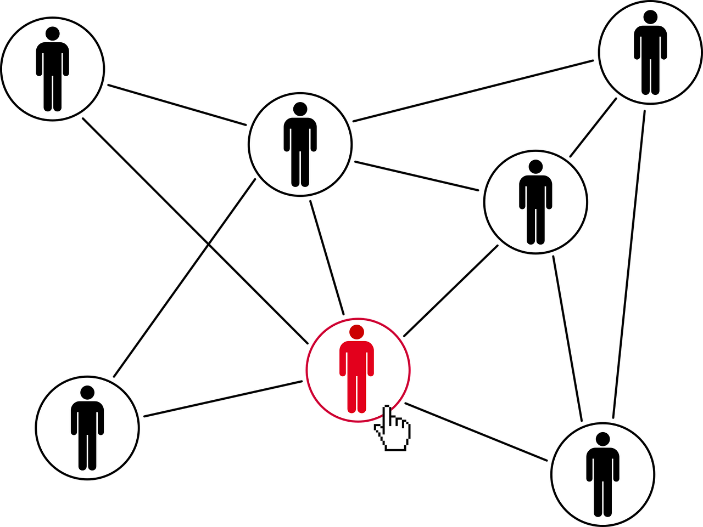

# Detecting Potential Candidates Who are Looking for New Job
Yang Liu Kunz
 Springboard Data Science Career Track, June 2020 cohort

# Capstone Project II
### Problem Statement: 
How can a training institute expand their business to include manpower recruitment by using the current credential/demographics/experience related data to predict the probability of an enrollee to look for a new job.

### Background:
Company XYZ is a training institute which conducts training for analytics/data science. They want to expand their business to include manpower recruitment (data science only). They aim to do so by connecting their enrollees with their clients who are looking to hire employees working in the same domain. Before that they want to know among the large number of signups, which of these candidates are looking for a new employment. To understand the factors that lead the enrollees to look for a job change, Company XYZ wants to build a model based on the current credentials, demographics and experience data they collected from the enrollees to predict the probability of them to look for a new job. By identifying as many target enrollees (potential candidates) as possible from all enrollees registered on the training platform, the recruiting team in company XYZ could approach to their targeted potential candidates more efficiently and effectively. 

### Data Source:
The dataset are sourced from https://www.kaggle.com/aswathrao/hr-analysis 
The dataset train.csv used in this project, was collected on August 12, 2020. It consists of 18,359 rows and 14 columns, 4 of them are numerical columns and 10 of them are categorical columns. Each row contains credentials/demographic/experience data for each unique enrollee. 

### Objective:
- To explore and analyze enrollee data for XYZ training institute 
- To identify the key features that lead the enrollee to look for new employment.
- To develop machine learning models that predict the probability of enrollee looking for a new job
- To identify the final model that captures the most target enrollees within the top 20%, top 50% of the test dataset ordered by their prediction scores (in descending order)

### Reports
1. Capstone Project II Project Proposal
2. Jupyternotebook
3. Capstone Project II Final Report
4. Capstone Project II Final Presentation
